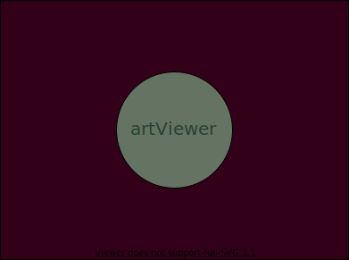
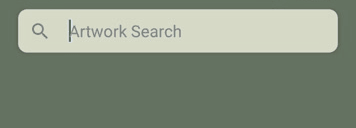
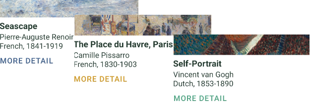

# <p align="center">artViewer</p>
### <p align="center">Mobile Art Application Using the Art Institute of Chicago API</p>

### <p align="center">CS 455 - Mobile Computing: React-Native Project</p><p align="center">University of Regina</p>

<div align="center">

<a href="https://github.com/hanley2d/artViewer"></a>
<a href="https://github.com/hanley2d/artViewer/issues"></a>

</div>

## Table of Contents
1. [Project Description](#project-description)
2. [Features](#features)
3. [Installation Instructions](#installation-instructions)
4. [Operating Instructions](#operating-instructions)
5. [File Manifest](#file-manifest)
6. [Copyright Information](#copyright-information)
7. [Contact Information](#contact-information)
8. [Bug List](#bug-list--shortcomings)
9. [Troubleshooting](#troubleshooting-tips)
10. [References and credits](#references-and-credits)

## Project Description

This project is a React Native application for viewing artwork and information from the Art Institute of Chicago's public API. The AIC API is a REST-style API that provides data on tonnes of information regarding the Arts Institute of Chicago. This app fetches data from the API about artork located in the museum. It allows the user to search for artwork as well as browse categories and view artwork at random.

### Purpose
One of the main purposes of this project on a personal level was to learn how to work with an API. Fetching data in React Native is made relatively simple with the [Fetch API](https://reactnative.dev/docs/network) method. The more difficult part is fetching the data exactly when you need it. The React useEffect hook can be used to fetch data only when specific events occur, for example, when a state is updated. This application uses the useEffect hook combined with the Fetch API in order to fetch data from the AIC API only when requested by the user. Probably some of the methods I used are naive and may not always follow the best practices, but I believe it works well enough for the purposes of this application.

The reason I chose to work with this specific API is because I enjoy museums. I visited the Art Institute of Chicago a few years ago and was very impressed. I hope to go back someday but, being a university student during a global pandemic, now is not the best time to do that. This app allows me and any other user to see the artwork from anywhere without having to be in Chicago, albeit on a small, somewhat unimpressive screen.

### AIC API
The [AIC API](https://api.artic.edu/docs/) is publicly available for use without need of authorization. Unauthorized users are permitted to make 60 requests to the API per minute before their IP address is timed out. Unless there is a bug that I have not encountered, the way the application is designed should make it quite difficult to exceed that number, although a user could potentially be timed-out by spamming button presses. This app requests only a small amount of information of what is available, including the art id, artist information, title, medium, dominant colour as well as the image id. The image id is required in order to hotlink the images in the application, which is the recommended practice by the AIC. Displaying all the different images can be done by inserting the image id into an address provided by the AIC like so: 
```javascript
const image_link = `https://www.artic.edu/iiif/2/${image_id}/full/843,/0/default.jpg`;
```
The data that is collected from the API includes the id, title, image id, date, artist information, medium and dominant colour. To do this, a fetch request is made to the following address:

```js
const api_query = `https://api.artic.edu/api/v1/artworks/search?q=${query}&limit=10&fields=id,title,image_id,date_display,artist_display,medium_display,color&page=${currPage}`
```
The response object for one of the artworks looks like this: 
```bash
Object {
      "_score": 147.65532,
      "artist_display": "Georges Seurat
French, 1859-1891",
      "color": Object {
        "h": 59,
        "l": 52,
        "percentage": 0.002095873918287094,
        "population": 1217,
        "s": 12,
      },
      "date_display": "1884/86",
      "id": 27992,
      "image_id": "2d484387-2509-5e8e-2c43-22f9981972eb",
      "medium_display": "Oil on canvas",
      "title": "A Sunday on La Grande Jatte — 1884",
    },
```
---


## Features

### Main Features


  

#### Search Artwork
The SearchArtwork screen allows the user to search for any artwork in the AIC collection. While the fetch request is being performed an activity indicator (spinning circle thing) will appear until the data can be loaded. Once the data has been fetched, the response object will be loaded into a flatlist of cards which features a cropped image of the artwork as well as the title and artist name. The user is also able to view more information about the artwork by pressing "more detail" or navigate to one of the other screens by means of the bottom tab navigation bar.

<br clear="left"/>
<br />


#### Pagination
Search results are paginated in pages of 10 items. The user can proceed to the next page or backtrack to the previous page. The scroll bar automatically scrolls to the top when the user presses to the next or previous page. The pagination data is provided by the AIC API. The state of the user's current page is maintained in a state hook, and updated when the user presses a button. This update causes a useEffect hook to fetch the next page of data from the API.

<br clear="left"/>
<br />


#### Artwork Detail
The user can view an artwork with more detail by pressing the 'more details' button on one of the FlatList items. The artwork uses an animated fade-in effect in order to not be too abrupt of a change when transitioning from one screen to the next.

<br clear="left"/>
<br />


#### Browse Art Categories
Users who aren't certain what to search can also browse certain collections by category. There are only a few categories for now but more can be added with ease. The horizontal scrollbar allows multiple categories to be added without taking up too much room on the screen at one time.

<br clear="left"/>
<br />


#### View a Random Artwork

Want more variety? The random artwork screen allows the user to randomly select one of the over 100 000 pieces of artwork from the AIC. A random image is found by setting the limit to one and the page number to the random number.

<br clear="left"/>
<br />

### Smaller Features

#### Activity Indicator




When a user makes a search or presses a button, an activity indicator (spinning circle thing) will appear to let the user know that the information is being processed. The indicator disappears when the data has been fetched and rendered to the screen.

<br clear="left"/>
<br />

#### Tab Bar Page Navigation


The app has a tab navigation bar at the bottom that the user can use to navigate to different screens. This is provided by [React Navigation](https://reactnavigation.org/docs/bottom-tab-navigator/).

### Frivolous Details

#### Artwork's Dominant Colour


<br clear="left"/>
<br />
The "more details" button on the FlatList item card is the colour of the artwork's dominant colour. This is one of the pieces of information provided by the AIC API. It is a completely pointless detail but I thought it was cool so I'm drawing attention to it now.

The command used to capture the colour:
```js
var item_color = "";
if (item.item.color !== null) {
     item_color = `hsl(${item.item.color.h}, ${item.item.color.s}%, ${item.item.color.l}%)`;
}
```
---

## Installation Instructions

The artViewer application can be installed on an Android device by sideloading the APK file in the [releases](https://github.com/hanley2d/artViewer/releases) section of this repository. To do this, just download the file on an Android device, find the file and press it to install. You may need to enable additional settings on your device.

Alternatively, this application can be run on both Android and iOS from the [Expo Go](https://expo.dev/client) app or on the Expo [website](https://snack.expo.dev/@hanley2d/artviewer). 

If you have the Expo Go app you can scan the following QR code to run this application.


<br clear="left"/>
<br />

---
## Operating Instructions

When starting the artViewer application, the user is first taken to the Art Search screen where they can make a search query. They also have the option to navigate to the Browse Collections or Random Artwork screens. The bottom tab bar can be used to navigate between these three screens.

* <p>Art Search</p> On this screen the user can use the search bar to make a query to the API. The query will be send when the user presses the enter key on their keyboard or the magnifying glass icon on the search bar. An activity indicator will appear while the data is being fetched. Once the response has been received, the data items will be loaded into a flatlist and the user can scroll the results. Pressing the 'more details' button will take the user to the Art Detail screen where they will be presented with a more detailed view of the artwork as well as some additional information about the piece. The user can also go to the next page or return to the previous page by pressing the 'PREV' and 'NEXT' buttons at the bottom of the screen.

* <p>Browse Collections</p> This screen works almost exactly the same as the Art Search screen, except there is a list of predetermined categories that the user can select from instead of a search bar. The user can horizontally scroll the list of categories and select any of the options.

* <p>Random Artwork</p> On this screen the user can view a randomly chosen artwork. Pressing the 'randomize' button generates a random number which is used to fetch one item from the API. The artwork image along with the information is then displayed below the button. If the response information is long enough to overfill the screen, the user can scroll down to view all the information.

---
## File Manifest

- <p style="color:#647362"><a href="https://github.com/hanley2d/artViewer/blob/master/App.js">App.js</a></p> This is the main App file for the project. It controls the navigation of the application. A tab navigator is used instead of the stack navigator that we were shown in class. It effectively functions in the same way, except the tab navigator has a built-in navigation bottom bar which I felt worked nicely for this application.
- <p><a href="https://github.com/hanley2d/artViewer/blob/master/view/ArtSearch.js">view/ArtSearch.js</a></p> This screen allows users to make their own queries to the API using the searchbar.
- <p><a href="https://github.com/hanley2d/artViewer/blob/master/view/ArtDetail.js">view/ArtDetail.js</a></p> This screen is displayed when the user presses the "more details" button on one of the flatlist items in ArtSearch.js and BrowseCellections.js.
- <p><a href="https://github.com/hanley2d/artViewer/blob/master/view/BrowseCollections.js">view/BrowseCollection.js</a></p> The screen for the Browsing Collection. It is very similar to the ArtSearch screen, the difference being that the search queries are predetermined as buttons with subjects.
- <p><a href="https://github.com/hanley2d/artViewer/blob/master/view/RandomArt.js">view/RandomArt.js</a></p> The screen for displaying random artwork. It is fairly similar in function to the ArtDetail page.
- <p><a href="https://github.com/hanley2d/artViewer/blob/master/view/components/colors.js">components/colors.js</a></p> Used to define the custom colours used for the application. The colours are meant to be subtle and non-imposing so as not to draw attention away from the artwork. Kind of like an art museum.
- <p><a href="https://github.com/hanley2d/artViewer/blob/master/view/components/ListItem.js">components/ListItem.js</a></p> Defines a custom card component that is used to display the items in the flatlists of ArtSearch.js and BrowseCollections.js
- <p><a href="https://github.com/hanley2d/artViewer/blob/master/view/components/RandomButton.js">components/RandomButton.js</a></p> Custom pressable with an opacity effect added for when it is pressed.
- <p><a href="https://github.com/hanley2d/artViewer/blob/master/view/components/ScrollViewButton.js">components/ScrollViewButton.js</a></p> Custom pressable with an opacity effect added for when it is pressed. It is designed to be used within a horizontal scrollview so users can scroll through multiple category buttons.
- <p><a href="https://github.com/hanley2d/artViewer/blob/master/controller/FetchData.js">controller/FetchData.js</a></p> Contains the main fetch request for both the ArtSearch.js and BrowseCollection.js files. 
- <p><a href="https://github.com/hanley2d/artViewer/blob/master/controller/fetchRandom.js">controller/fetchRandom.js</a></p> Fetches a random image from the API.

---
## Copyright Information
Over 50,000 images from the Art Institute of Chicago API are in the public domain, however there are some works that may not be in [some circumstances](https://www.artic.edu/terms). This project is purely educational and not for commercial purposes so it should fall under the fair use/fair dealing exception.

The code for this project falls under an [MIT license](https://github.com/hanley2d/artViewer/blob/master/LICENSE) and is open source. 

---

## Contact Information
The best way to contact me about any problems with this project is to create a new issue in the [issues section](https://github.com/hanley2d/artViewer/issues) of the project. For any other inquiry, I can be reached at hanley2d@uregina.ca.

---

## Bug List
1. When the user presses the back button from the ArtDetail screen after having navigated there from the BrowseCollections screen, it will return them to the ArtSearch screen instead of back to the BrowseCollection screen. I believe this is because the Art Viewer screen is the "home" screen of this application. I think this could be fixed by creating a separate stack container for both the ArtSearch and BrowseCollections screen but I did not have time to implement it and the problem does not break the functionality of the app. The user can still press the BrowseCollections button to go back to that screen.

---
## Troubleshooting Tips
- The paginaton may stop working if the app has been minimized and unused for a period of time. Closing the app and opening it again will fix the problem, although the fetch data will be lost.

---
## Potential Future Improvements
1. Implement different stack containers for the ArtSearch and BrowseCollection screens as mentioned in the [bug list](#bug-list) section.
2. Image display size: The way the app is set up, the correct aspect ratio of the image is maintained but the maximum height of an image is the width of the screen. This means that images that are significantly longer than they are wide will be displayed a bit smaller than is ideal. I didn't have time to figure out a better solution within the timelines of the project but hope to do so in the future.

---
## References and Credits
1. [Art Institute of Chicago API](https://api.artic.edu/)
2. [React Navigation Bottom Tab Navigator](https://reactnavigation.org/docs/bottom-tab-navigator/)
3. [Solution](https://stackoverflow.com/questions/52362166/react-navigation-hide-one-tab) for how to hide tab bar button for the ArtDetail screen.
4. [Ionicons icons](https://oblador.github.io/react-native-vector-icons/) used for navigation bar.
5. [useNavigation](https://reactnavigation.org/docs/use-navigation/) hook used to pass response object to ListItem component.
6. [React Native Paper:](https://callstack.github.io/react-native-paper/) used the SearchBar, Card and Button components.
7. [Github repo](https://github.com/davidrazmadzeExtra/FetchAPI_Movies/blob/main/App.js) that was the inspiration for using the activity indicator when fetching data.
8. [Information on fetch requests in React Native](https://reactnative.dev/docs/network)
9. [Helpful tutorial](https://www.youtube.com/watch?v=PgZ9npYJZzU) on asynchronous functions used for fetching data.